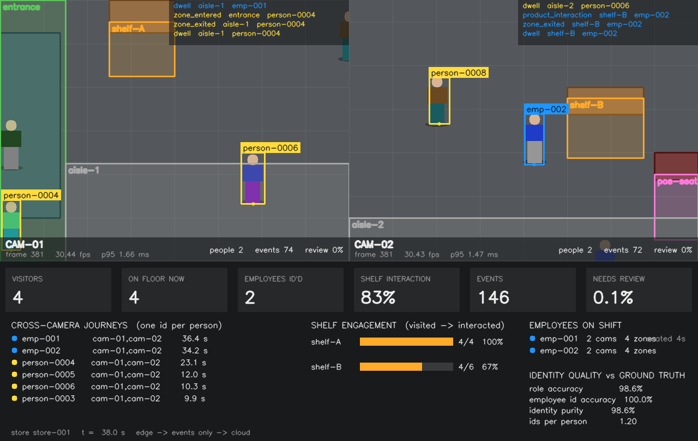
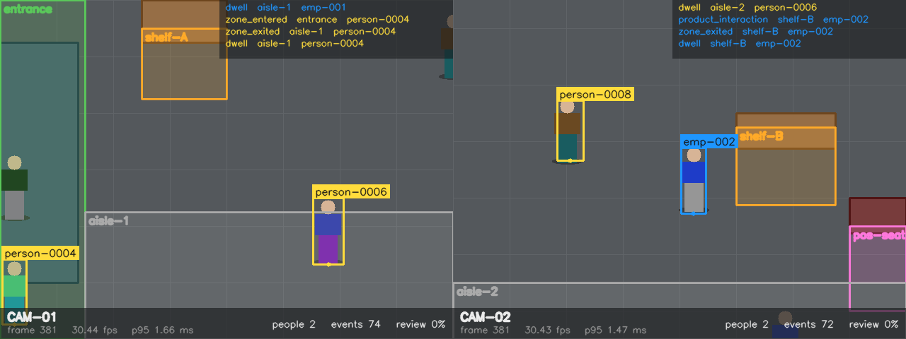

# Retail Vision Analytics

Multi-camera retail analytics with computer vision: person detection, tracking,
cross-camera re-identification, employee identification and zone events (entries, dwell
time, shelf interactions, seat occupancy) on an edge-first pipeline, with cloud analytics
and per-camera monitoring.

Built as a production-shaped proof of concept for the classic retail brief: *20 cameras per
store, 300 stores, tell me who entered, who sat where and for how long, which shelves people
touch, and which employee is which, without double counting anyone across cameras.*



*Two overlapping cameras of a synthetic store. Orange boxes are employees resolved to an
enrolled `employee_id`, yellow boxes are anonymous customers that keep one id across both
cameras. The lower panel is the cloud side: KPIs, cross-camera journeys, shelf conversion,
staff presence and identity quality against ground truth.*

## What is in the box

| Layer | What it does |
|---|---|
| **Edge pipeline** | `frame -> detector -> tracker -> role classifier -> embedder -> identity resolver -> zone events -> sink`. One worker per camera, identity and de-duplication shared per store. Video never leaves the store; only JSON events do. |
| **Detection** | Backend-agnostic interface. Ultralytics YOLO and a pure ONNX Runtime backend for real deployments; an oracle-with-noise and a pixel-based background-subtraction detector for tests and the simulator. |
| **Tracking** | SORT-style tracker (Kalman + Hungarian on IoU), numpy/scipy only. Reports raw detection boxes so ReID crops are never smoothed. |
| **Identity** | Two levels: employee vs customer, then *who*. Employees are matched to an enrolled gallery with match/review thresholds and a margin check; customers get one anonymous id per visit across cameras (online gallery with TTL). Crop quality gate, sticky track bindings with periodic re-verification, and a guard against gallery poisoning. |
| **Events** | Zone polygons per camera with enter/exit hysteresis, dwell time, shelf interaction heuristic, seat occupancy, store-level de-duplication window. |
| **Cloud** | FastAPI ingest + DuckDB analytics: visitors, dwell per zone, shelf visited-to-interacted conversion, employee presence, cross-camera journeys, review queue, camera health. Same SQL ports to BigQuery/Snowflake. |
| **Monitoring** | Per-camera FPS, latency p50/p95, people per frame, confidence, review ratio, embedding drift score; optional Prometheus gauges. |
| **Training** | CCTV-oriented, bbox-aware augmentation (turn 100 labelled frames into thousands), YOLO fine-tune + ONNX export, employee enrolment, ReID metrics (rank-1/5, mAP) and data-driven threshold selection at a target false-accept rate. |
| **Simulator** | A synthetic store with fixtures, zones, scripted employees and customers and two overlapping cameras, with ground truth, so identity logic is tested by numbers in CI. |

## Quick start

```bash
git clone https://github.com/CristianCaro-portfolio/retail-vision-analytics.git
cd retail-vision-analytics
pip install -e ".[dev]"

rva simulate --frames 600          # run the two-camera store, write data/events.jsonl
rva report data/events.jsonl       # cloud analytics over the events (DuckDB)
rva evaluate --frames 600          # identity quality vs ground truth
rva render --frames 600 --every 0  # annotated MP4 per camera + dashboard video in data/frames
pytest                             # 21 tests, ~10 s on CPU
```

Everything above runs on a laptop CPU in seconds with no model downloads. With the
`[models]` extra, switch `detector.backend` to `yolo` or `onnx` and `reid.backend` to `onnx`
(an exported OSNet) in the store YAML and point the cameras at RTSP URLs or files:

```bash
pip install -e ".[models]"
rva run-camera cam-01 --config configs/my_store.yaml
```

Cloud API and an edge simulator posting to it:

```bash
docker compose up --build
curl localhost:8000/v1/analytics/summary
curl localhost:8000/v1/analytics/journeys
```

## Results on the synthetic store

600 frames, 2 cameras, 2 employees and 8 customers with scripted paths, scored against
ground truth with `rva evaluate`. *Ids per person* is the fragmentation metric: 1.0 means
every person kept exactly one id across both cameras for the whole visit.

| Scenario | Role accuracy | Employee id accuracy | Identity purity | Ids per person |
|---|---|---|---|---|
| Oracle detector, 3% misses (default) | 100% | 100% | 98.8% | 1.30 |
| Oracle detector, 15% misses | 99.6% | 100% | 99.6% | 1.50 |
| Pixel noise sigma 12 | 100% | 97.5% | 98.8% | 1.40 |
| Pixel-only background-subtraction detector | 97.9% | 94.4% | 96.3% | 2.00 |

The last row is the honest one: a weak detector that merges overlapping people into one
blob is what breaks identity, which is why the detector is swappable and evaluated
separately (mAP) from the identity logic.

Analytics produced from the same run (`rva report`):

| Metric | Value |
|---|---|
| Unique visitors through the entrance | 5 |
| Shelf A: visited -> interacted | 7 -> 7 (100%) |
| Shelf B: visited -> interacted | 6 -> 5 (83%) |
| Employees identified across both cameras | 2 of 2, avg confidence 0.99 |
| People followed across both cameras with one id | 10 |
| Events that needed review | 1 of 196 |
| Edge throughput (CPU, mock models) | ~290 fps per camera, p95 latency 1.1 ms |

Throughput numbers are for the pipeline logic only (mock detector and histogram
embedder); with a nano YOLO on ONNX Runtime expect 20-60 fps per camera on a CPU edge box
and considerably more on a Jetson or a small GPU, which is why embeddings are computed
every 3rd frame per track and only on clean crops.

## How identity works



1. **Role first.** Employee vs customer from the torso band (uniform colour in the
   simulator; a fine-tuned class or a small classifier head in production). Majority vote
   over the last frames absorbs single-frame occlusions.
2. **Employees: enrolled gallery.** Appearance embedding vs consented enrolment photos
   keyed by `employee_id`. Above `match_threshold` accept; between `review_threshold` and
   `match_threshold` emit with `needs_review`; below it stays `employee-unknown-*`. A margin
   check rejects ambiguous matches between two look-alike staff.
3. **Customers: anonymous online gallery.** Matched only against people seen in the last
   `identity_ttl_seconds`; one `person-XXXX` per visit across all cameras, then forgotten.
4. **Quality gate.** Crops touching the frame border, too small or too wide are never
   embedded. A person is tracked immediately but only named once seen whole. This one rule
   removed most fragmentation.
5. **No forced identities.** Every event carries a confidence and a review flag; the review
   queue is the retraining loop (hard negatives for ReID).

Thresholds are not guessed: `rva reid-thresholds gallery.npz --target-far 0.01` derives
them from the impostor similarity distribution of the enrolled gallery and reports the
genuine-accept rate you pay for them.

## Repository layout

```
src/retail_vision/
  config.py           typed store/camera/zone/threshold config (pydantic + YAML)
  types.py            BBox, Detection, Track, Identity, Event
  detection/          Detector interface: yolo, onnx, oracle (GT+noise), color blob
  tracking/           SORT tracker, Kalman filter
  reid/               embedders (histogram, onnx, osnet), gallery, role, quality gate, resolver
  events/             zone geometry, enter/exit/dwell/interaction state machine, dedup
  pipeline/           CameraWorker, StoreRuntime, SimulationRunner
  sinks/              memory, stdout, jsonl, http batch (buffers when offline)
  cloud/              FastAPI ingest + DuckDB analytics queries
  monitoring/         per-camera metrics, drift monitor, Prometheus gauges
  training/           augmentation, YOLO fine-tune/export, enrolment, ReID eval + thresholds
  simulation/         synthetic store, frame sources, evaluation vs ground truth, rendering
  cli.py              `rva` commands
configs/              store_demo.yaml (jsonl sink), store_demo_http.yaml (cloud sink)
docs/                 architecture.md, ADRs, images
tests/                tracking, reid, events, augmentation, end-to-end (pipeline -> API)
docker/               edge and cloud images; docker-compose.yml wires them
```

## CLI

| Command | Purpose |
|---|---|
| `rva simulate` | run the synthetic store end to end and write events |
| `rva evaluate` | fragmentation, purity, role and employee-id accuracy vs ground truth |
| `rva render` | annotated frames, per-camera MP4 and a dashboard MP4 |
| `rva report` | analytics report from an events JSONL (DuckDB) |
| `rva run-camera` | one camera worker over a file/RTSP source with real models |
| `rva serve-api` | cloud ingest + analytics API |
| `rva augment` | expand a small YOLO dataset with CCTV-oriented augmentation |
| `rva train-detector` | fine-tune YOLO, evaluate mAP, export ONNX |
| `rva build-gallery` | enrol employees from `<root>/<employee_id>/*.jpg` |
| `rva reid-thresholds` | data-driven match/review thresholds + rank-1/rank-5 |

## Design notes

See [docs/architecture.md](docs/architecture.md) and the ADRs in [docs/adr](docs/adr):
edge-first inference, two-level identity with a review band, and the synthetic store as the
test bed. Short version: video stays in the store, every identity decision has a confidence
and a way to say "I do not know", and the whole identity chain is regression-tested against
ground truth in CI.

## Roadmap

- ByteTrack backend behind the same tracker interface.
- Redis-backed identity resolver for stores with more than one edge box.
- Homography per camera so zones can be drawn once on the floor plan instead of per camera.
- Hand/product interaction model to replace the proximity heuristic on shelves.
- Grafana dashboard over the Prometheus gauges and the review queue.

## License

MIT
